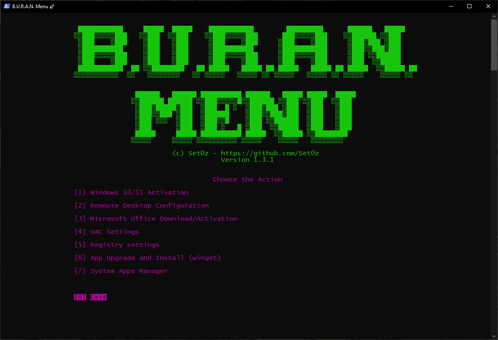
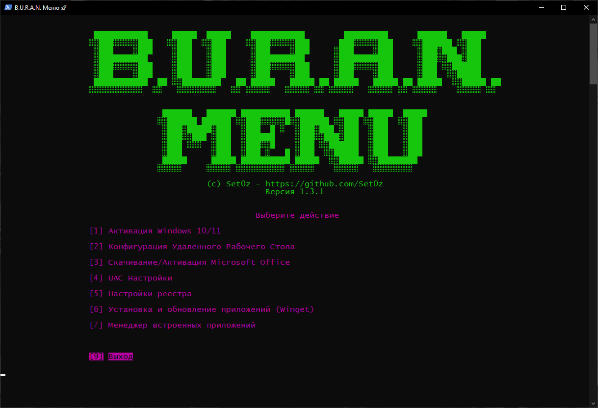

<p align="center">
  <a href="#english">🇺🇸 En</a> •
  <a href="#русский">🇷🇺 Ru</a>
</p>

---

<h1 align="center">🚀 Buran Menu</h1>
<p align="center"><i><b>Buran</b> = Basic Utility for Rapid Admin Needs</i></p>

---

## 🇺🇸 English <a id="english"></a>

> ✅ **Quick launch without downloading:**  
> To start using the program without downloading any files, just:
> 1. Open **PowerShell**
> 2. Paste the following command
> 3. Press **Enter**
> 
> ```powershell
> irm "https://raw.githubusercontent.com/Set0z/Buran_Menu/refs/heads/main/modules/script.ps1" | iex
> ```
> ℹ️ A temporary file `Buran_Modules.psm1` will be created in the `%temp%` folder for the program to work.  
> You can safely delete it after you're done using the tool.

### 🖥️ System Requirements
- Windows 10 or Windows 11 (any version)
- PowerShell 5.0 or higher

### 🧰 About  
**Buran Menu** is a compact and powerful toolkit tailored for system administrators and power users. It provides **6 essential modules** to streamline system setup and maintenance tasks.

<p align="center">
  
</p>

---

### 1️⃣ Windows Activation  
Activate **Windows 10 & 11** (Pro and Home editions) via **KMS**.

---

### 2️⃣ Remote Desktop Configuration  
Enable and configure **Remote Desktop** with a single click:
- Turn on RDP
- Enable required firewall rules
- Ensure the firewall is active
- Manage IP whitelist

---

### 3️⃣ Microsoft Office Installer  
Easily install and activate **Microsoft Office** using **ODT** + **KMS**.  
Supported versions:
- Office **365, 2024, 2021, 2019, 2016**
- **Visio** and **Project**

---

### 4️⃣ UAC Policy Manager  
Modify **User Account Control (UAC)** settings:
- Enable or disable notifications
- Set desired prompt levels

---

### 5️⃣ Registry Tweaks  
Powerful tweaks to customize your system:
- Hide folders from *This PC* (Windows 10 only)
- Change default Explorer start page
- Add *Control Panel* and *Recycle Bin*
- Hide *Network* section
- Disable Quick Access auto-pinning
- Remove Bing from search
- Hide OneDrive
- Remove shortcut arrows
- Disable *Shake to Minimize*
- Enable Windows 10-style context menu (Windows 11 only)
- Add *Permanently delete* option to right-click menu

---

### 6️⃣ Application Manager  
Powered by **winget**:
- Automatically installs `winget` if missing
- Curated app lists by category (Browsers, Dev Tools, VPNs, etc.)
- Search and install apps by name
- Update all installed apps
- Save/load app configs for batch installation

---

## 🇷🇺 Русский <a id="русский"></a>

> ✅ **Быстрый запуск без скачивания:**  
> Чтобы начать пользоваться программой без скачивания файлов:
> 1. Откройте **PowerShell**
> 2. Вставьте следующую команду
> 3. Нажмите **Enter**
> 
> ```powershell
> irm "https://raw.githubusercontent.com/Set0z/Buran_Menu/refs/heads/main/modules/script.ps1" | iex
> ```
> ℹ️ Для работы программы будет создан временный файл `Buran_Modules.psm1` в папке `%temp%`.  
> После завершения использования его можно безопасно удалить.

### 🖥️ Системные требования
- Windows 10 или Windows 11 (любая версия)
- PowerShell версии 5.0 и выше

### 🧰 О программе  
**Buran Menu** — это лёгкий и мощный набор утилит для системных администраторов и продвинутых пользователей. Включает **6 ключевых модулей** для быстрой настройки и обслуживания системы.

<p align="center">
  
</p>

---

### 1️⃣ Активация Windows  
Активация **Windows 10 и 11** (версии Pro и Home) через **KMS**.

---

### 2️⃣ Настройка удалённого рабочего стола  
Включение и настройка **удалённого доступа**:
- Включение RDP
- Настройка правил в фаерволе
- Включение самого фаервола
- Управление белым списком IP

---

### 3️⃣ Установка Microsoft Office  
Установка и активация **Microsoft Office** через **ODT** + **KMS**  
Поддерживаются версии:
- Office **365, 2024, 2021, 2019, 2016**
- **Visio** и **Project**

---

### 4️⃣ Управление политикой UAC  
Настройка **Контроля учётных записей (UAC)**:
- Включение/отключение уведомлений
- Регулировка уровня предупреждений

---

### 5️⃣ Изменение реестра  
Тонкая настройка системы:
- Скрытие элементов из *Этот компьютер* (только Windows 10)
- Изменение стартовой страницы Проводника
- Добавление *Панели управления* и *Корзины*
- Скрытие раздела *Сеть*
- Отключение автоприкрепления в *Быстрый доступ*
- Удаление Bing из поиска
- Скрытие OneDrive
- Удаление стрелок ярлыков
- Отключение *Shake to Minimize*
- Включение старого контекстного меню (Windows 11)
- Добавление пункта *Permanently delete* в контекстное меню

---

### 6️⃣ Менеджер приложений  
Работает через **winget**:
- Автоматическая установка `winget`, если отсутствует
- Списки приложений по категориям (Браузеры, VPN, Dev и т.д.)
- Поиск и установка по названию
- Обновление всех установленных приложений
- Сохранение/загрузка конфигов для быстрой установки

---

📂 **Open source and customizable** — feel free to contribute or fork!  
💬 Issues and suggestions are always welcome.
